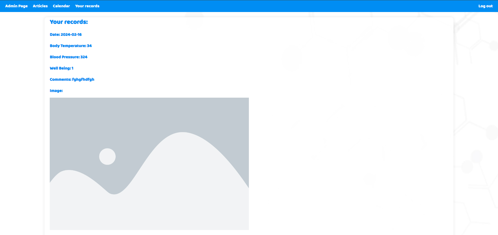

# Health Diary

## Description
My application, Health Diary, enables users to monitor and record their physical condition, including body temperature, blood pressure, and other vital signs, throughout the day. Health Diary provides users with a convenient platform to input and track their health metrics, allowing for better insights into their overall physical well-being. By maintaining a record of these vital signs over time, users can identify trends, detect abnormalities, and make informed decisions about their health

## Run locally
Open up your terminal and run the following:
```
docker-compose build
docker-compose up
```
## DB diagram


## App pages views



